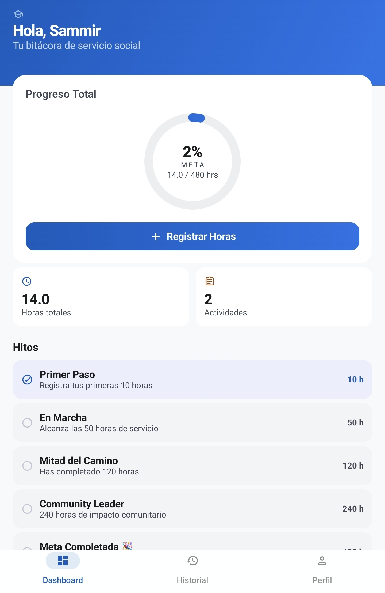
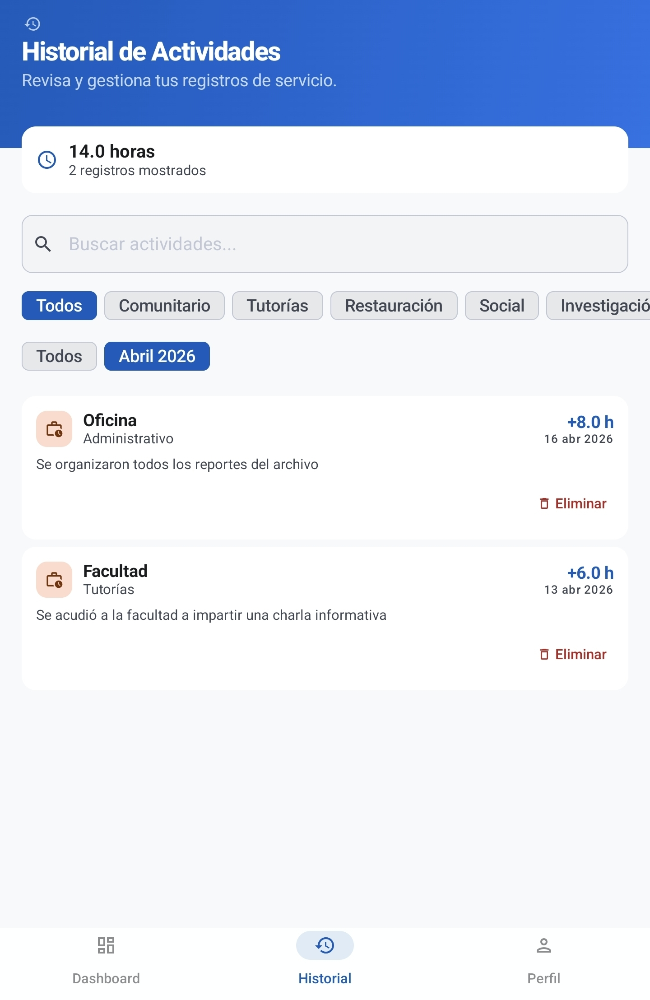
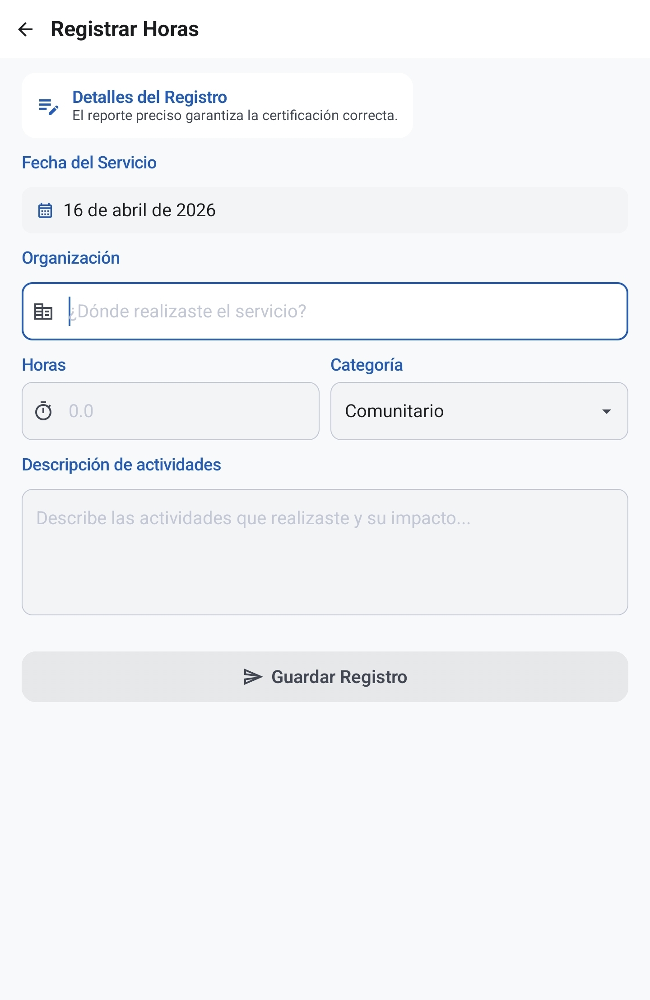

# Horapp

**Horapp** es una aplicación nativa para Android diseñada específicamente para estudiantes y profesionales que necesitan llevar un registro preciso y estructurado de sus horas de servicio social, prácticas profesionales o voluntariado. 

Horapp te permite olvidarte de las libretas y hojas de cálculo, centralizando todo tu progreso en tu dispositivo y generando reportes formales listos para entregar.

---

## Screenshots

  
   
  

---

## Características Principales

*   **Dashboard Interactivo:** Visualiza tu progreso hacia tu meta de horas con anillos de progreso dinámicos y métricas al instante.
*   **Registro Rápido:** Añade nuevas entradas (horas de tutoría, laboratorio, servicio comunitario, etc.) de forma rápida y sencilla.
*   **Historial Filtrable:** Revisa, busca y filtra todos tus registros por mes o tipo de actividad.
*   **Sistema de Hitos** Mantente motivado. La app calcula automáticamente tus logros a medida que acumulas horas.
*   **Generador de Reportes PDF:** Exporta todo tu historial formalmente a un documento PDF.

---

## Tecnologías y Arquitectura

Horapp está construida utilizando el stack moderno recomendado por Google para el desarrollo Android:

*   **Lenguaje:** [Kotlin](https://kotlinlang.org/)
*   **Interfaz de Usuario:** [Jetpack Compose](https://developer.android.com/jetpack/compose) (Material Design 3)
*   **Arquitectura:** MVVM (Model-View-ViewModel) con Clean Architecture.
*   **Inyección de Dependencias:** [Dagger-Hilt](https://dagger.dev/hilt/)
*   **Base de Datos Local:** [Room](https://developer.android.com/training/data-storage/room) (SQLite offline-first)
*   **Concurrencia:** [Coroutines](https://kotlinlang.org/docs/coroutines-overview.html) & [Flow](https://kotlin.org/api/kotlinx.coroutines/kotlinx-coroutines-core/kotlinx.coroutines.flow/-flow/)
*   **Navegación:** Jetpack Navigation Component para Compose.
*   **Testing:** JUnit4, MockK, Turbine (Coroutines testing) y Compose UI Testing.

---

## Instalación

Puedes descargar el último archivo `.apk` disponible en la sección de **Releases** de este repositorio e instalarlo en tu dispositivo Android.

https://github.com/lalobtw/Horapp/releases/latest

---

## Licencia

Este proyecto está bajo la Licencia **MIT**. Consulta el archivo `LICENSE` para más detalles.
